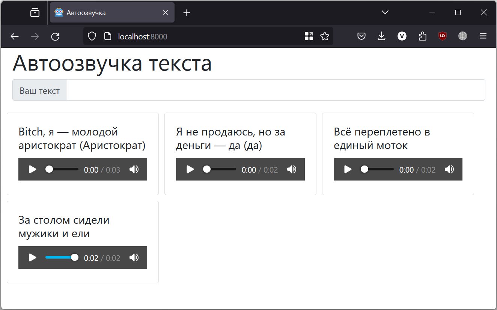

# WebTTSProject
Итоговый проект по курсу «Программные средства для задач искусственного интеллекта»



## Описание
Сервис предоставляет веб-интерфейс с возможностью ввода текста и получения его озвучки посредством модели [Silero TTS](https://pytorch.org/hub/snakers4_silero-models_tts/).
Пользователь вводит текст, нажимает клавишу `Enter`, и на странице появляется блок с плеером для прослушивания.
История генераций сохраняется и выводится заново при обновлении страницы.

Архитектурно система представляет собой два Docker-контейнера: вебсервис и базу данных PostgreSQL.
Вебсервис реализует API на базе Python и FastAPI и интерфейс взаимодействия с моделью, написанный на HTML и JavaScript. Инференс модели производится с помощью библиотеки PyTorch.
В БД сохраняются файлы озвучки, время их создания и исходный текст.

Перед генерацией текст предобрабатывается: производится транслитерация некириллических слов и запись чисел словами.
Итоговый файл перед сохранением и отправкой конвертируется в MP3. 

## Запуск
Для запуска требуется установленный Docker с утилитой `docker-compose`. Для сборки и запуска, находясь в корневой папке проекта, выполните команду:
```bash
docker-compose up --build -d
```

После старта обоих контейнеров окройте в браузере адрес `localhost:8000`. Если порт окажется занят, можно его поменять в файле `docker-compose.yml`.
